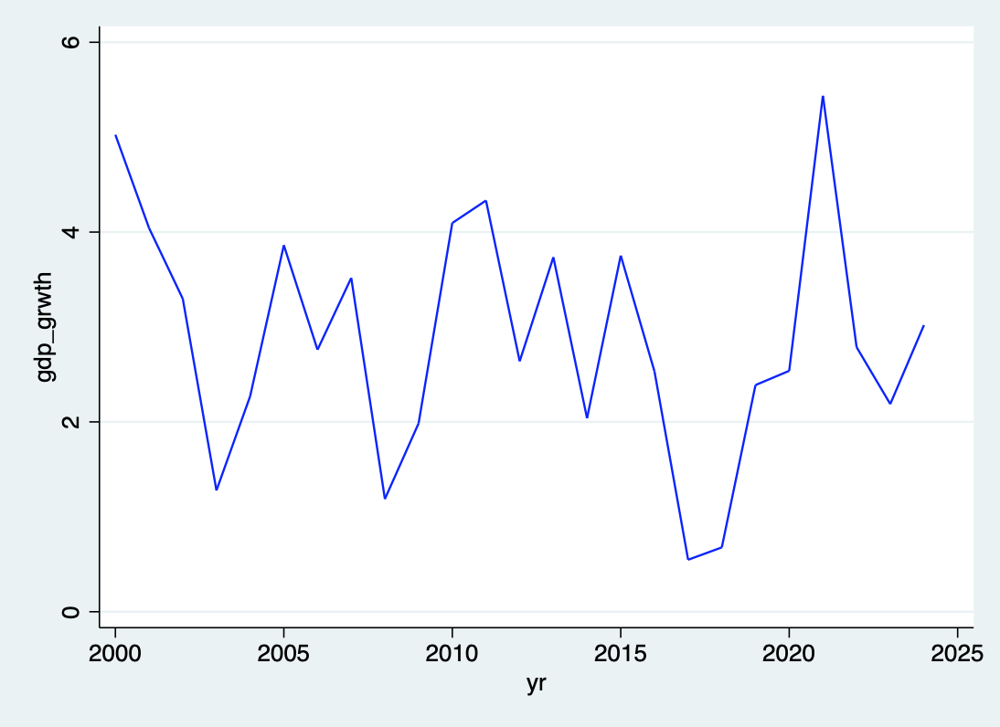
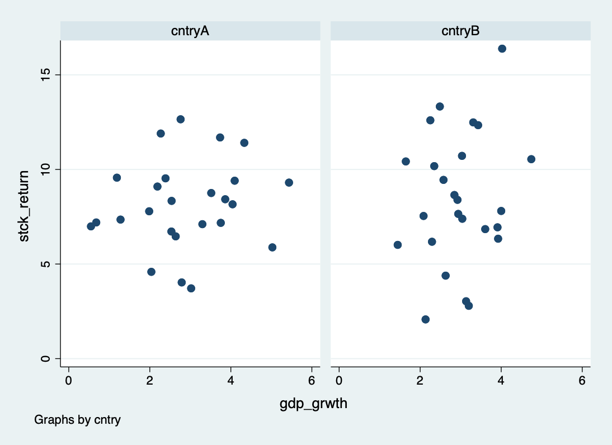
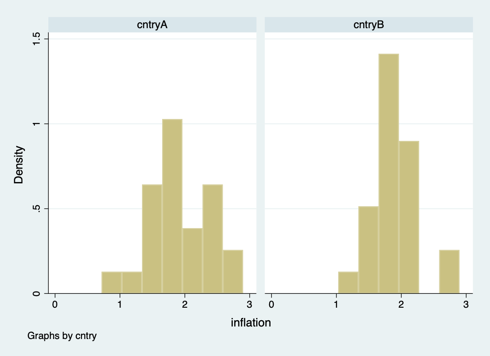

# Impact of Economic Indicators on Stock Market Performance: A Panel Data Analysis

## Project Overview
This project analyzes the impact of economic indicators on stock market performance in simulated countries A and B. I focused on synthetic data that includes data generation, merging datasets, cleaning and preprocessing data, and conducting regression and panel data analysis using STATA.

## Contents
- **data/**: Contains the generated datasets.
- **code/**: Includes the STATA script for data generation, merging, cleaning, and analysis.
- **results/**: Contains the output files and visualizations.
- **paper/**: Includes the research paper.

## How to Run the Analysis
1. Load the data in STATA.
2. Run the `analysis.do` script to generate, merge, clean, and analyze the data.
3. Review the results in the `results/` folder.

## Key Findings
- Regression analysis shows significant relationships between economic indicators and stock market returns.
- Panel data analysis reveals the importance of considering both fixed and random effects models to understand these relationships better.

## Results

[Download here](results/Analysis_Results.pdf)

### GDP Growth Over Time

(results/gdp_growth_by_country_B.png)

The line plot above shows the trend of GDP growth over time for CountryA and CountryB. It is evident that the country GDP growth averages at a higher rate over time.

### Stock Returns vs. GDP Growth

The scatter plot highlights the relationship between GDP growth and stock returns for both countries. We observe that country B performs averagely much higher than country A.

### Average Stock Returns by Country

(results/avg_stock_return.png)

The bar plot compares the average stock returns between CountryA and CountryB. It is clear that country B has a higher average stock return compared to the countryB.

### Distribution of Inflation Rates

The histogram shows the distribution of inflation rates for both countries. From the plot, we can see that the country B has a higher stock market capitalization which results in a higher average returns compared to country A.
